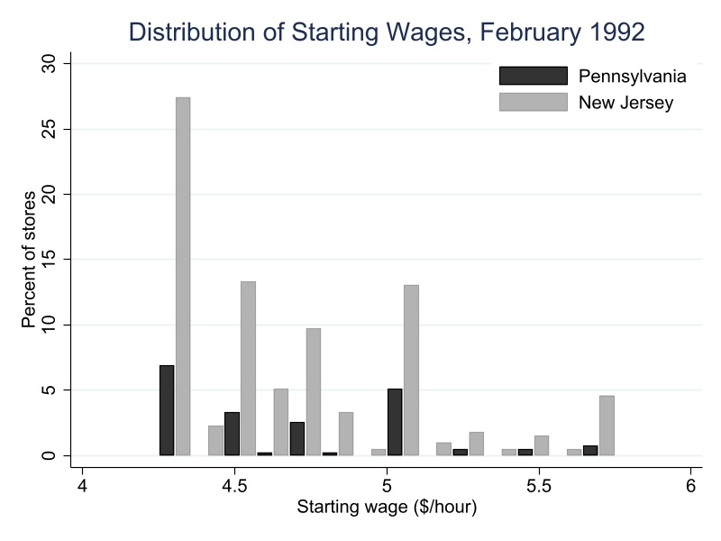

```{r setup, include=FALSE}
    library(Statamarkdown)
stataexe <- "D:/STATA17/StataMP-64.exe"
knitr::opts_chunk$set(eval = TRUE,
                      echo = TRUE,
                      warning = FALSE,
                      message = FALSE,
                      engine.path=list(stata=stataexe))


```


#  Introduction
On April 1, 1992, New Jersey increased its minimum wage from $4.25 to $5.05 per hour, while Pennsylvania maintained the federal minimum wage of $4.25. This policy change created a natural experiment to study the employment effects of minimum wage increases. Card and Krueger collected data from fast-food restaurants in both states before (February 1992) and after (November 1992) the policy change.The paper can be accesed from [here](https://davidcard.berkeley.edu/papers/njmin-aer.pdf).

# Data and Methodology

##  Data Collection

The datasets from this code can found [David Card's UC Berkerly faculty page](https://davidcard.berkeley.edu/data_sets). 

The study uses survey data from fast-food restaurants collected in two waves:
- **Wave 1**: February 1992 (before the minimum wage increase)
- **Wave 2**: November 1992 (after the minimum wage increase)

The sample includes four major fast-food chains: Burger King, KFC, Roy Rogers, and Wendy's.

## Data Preparation

The data preparation process involves importing the raw survey data and creating a comprehensive labeling system for all variables. The dataset is imported using a dictionary file that defines variable structures, followed by systematic labeling of all categorical variables including restaurant chains (Burger King, KFC, Roy Rogers, Wendys), states (Pennsylvania as control, New Jersey as treatment), employee benefits, survey response status, and various binary indicators for ownership type and regional locations.

```{stata, collectcode=TRUE}
cd "D:\njmin"

* Here I use a dictionary file that I prepared based on the codebook description

infile using "D:\njmin\njmin.dct", using("D:\njmin\public.dat") clear


label define CHAIN 1 "Burger King" 2 "KFC" 3 "Roy Rogers" 4 "Wendys"
label values CHAIN CHAIN


label define STATE 0 "Pennsylvania" 1 "New Jersey"
label values STATE STATE


label define MEALS 0 "None" 1 "Free meals" 2 "Reduced price" 3 "Both"
label values MEALS MEALS
label values MEALS2 MEALS


label define STATUS2 0 "Refused" 1 "Completed" 2 "Closed for renovation" 3 "Closed permanently" 4 "Highway construction" 5 "Mall fire"
label values STATUS2 STATUS2


label define YESNO 0 "No" 1 "Yes"
foreach var in CO_OWNED SOUTHJ CENTRALJ NORTHJ PA1 PA2 SHORE BONUS SPECIAL2 {
    label values `var' YESNO
}
```

##  Data Processing

The raw dataset contains interview dates in a compressed numeric format that requires processing to create proper date variables. The conversion process involves extracting date components, handling 2-digit to 4-digit year conversion, and formatting dates for STATA's internal date system.

```{stata, collectcode=TRUE}

tostring DATE2, gen(DATE2_str) format(%06.0f)


gen str2 mm = substr(DATE2_str, 1, 2)
gen str2 dd = substr(DATE2_str, 3, 2)
gen str2 yy = substr(DATE2_str, 5, 2)


gen str4 yyyy = cond(real(yy) < 30, "20" + yy, "19" + yy)


gen str10 DATE2_fmt = mm + "/" + dd + "/" + yyyy


gen date2 = date(DATE2_fmt, "MDY")
format date2 %td
label variable date2 "Second interview date"

drop DATE2 DATE2_str DATE2_fmt mm dd yy yyyy
ren date2 DATE2
save "D:\njmin\njmin_labeled.dta", replace
```
# Sample Design and Response Rates

## Taking a look at the response rates

The following code creates a comprehensive summary of survey response patterns across all stores and by state. The analysis systematically calculates response rates and reasons for non-response to assess data quality and potential selection bias.

```{stata,collectcode=TRUE}
* Summary statistics
summarize


clear all
set more off
use njmin_labeled.dta

qui count 
local all_stores = r(N)

qui count if STATUS2 == 1
local all_interviewed = r(N)

qui count if STATUS2 == 2
local all_renovations = r(N)

qui count if STATUS2 == 3
local all_closed = r(N)

qui count if STATUS2 == 4
local all_temp_closed = r(N)

qui count if STATUS2 == 5
local all_fire_closed = r(N)

qui count if STATUS2 == 0
local all_refused = r(N)


qui count if STATE == 0
local pa_stores = r(N)

qui count if STATE == 0 & STATUS2 == 1
local pa_interviewed = r(N)

qui count if STATE == 0 & STATUS2 == 2
local pa_renovations = r(N)

qui count if STATE == 0 & STATUS2 == 3
local pa_closed = r(N)

qui count if STATE == 0 & STATUS2 == 4
local pa_temp_closed = r(N)

qui count if STATE == 0 & STATUS2 == 5
local pa_fire_closed = r(N)

qui count if STATE == 0 & STATUS2 == 0
local pa_refused = r(N)


qui count if STATE == 1
local nj_stores = r(N)

qui count if STATE == 1 & STATUS2 == 1
local nj_interviewed = r(N)

qui count if STATE == 1 & STATUS2 == 2
local nj_renovations = r(N)

qui count if STATE == 1 & STATUS2 == 3
local nj_closed = r(N)

qui count if STATE == 1 & STATUS2 == 4
local nj_temp_closed = r(N)

qui count if STATE == 1 & STATUS2 == 5
local nj_fire_closed = r(N)

qui count if STATE == 1 & STATUS2 == 0
local nj_refused = r(N)


clear
set obs 7

gen Category = ""
gen All = .
gen PA = . 
gen NJ = .

replace Category = "Num_stores" in 1
replace All = `all_stores' in 1
replace PA = `pa_stores' in 1
replace NJ = `nj_stores' in 1

replace Category = "Num_Interviewed" in 2
replace All = `all_interviewed' in 2
replace PA = `pa_interviewed' in 2
replace NJ = `nj_interviewed' in 2

replace Category = "Num_Renovations" in 3
replace All = `all_renovations' in 3
replace PA = `pa_renovations' in 3
replace NJ = `nj_renovations' in 3

replace Category = "Num_Closed" in 4
replace All = `all_closed' in 4
replace PA = `pa_closed' in 4
replace NJ = `nj_closed' in 4

replace Category = "Num_temp_closed" in 5
replace All = `all_temp_closed' in 5
replace PA = `pa_temp_closed' in 5
replace NJ = `nj_temp_closed' in 5

replace Category = "Num_Close_due_to_fire" in 6
replace All = `all_fire_closed' in 6
replace PA = `pa_fire_closed' in 6
replace NJ = `nj_fire_closed' in 6

replace Category = "Refused_Second_Interview" in 7
replace All = `all_refused' in 7
replace PA = `pa_refused' in 7
replace NJ = `nj_refused' in 7

list, clean noobs


```

## Tabulating our results in a LaTeX table.

The following code writes a `.tex` file generating Table-1 from the paper using the data we aggregated above.

```{stata, collectcode=TRUE}

tempname myfile
file open `myfile' using "table1.tex", write replace


file write `myfile' "\documentclass{article}" _n
file write `myfile' "\usepackage{booktabs}" _n
file write `myfile' "\begin{document}" _n _n
file write `myfile' "\begin{table}[htbp]" _n
file write `myfile' "\centering" _n
file write `myfile' "\caption{Store Status Summary}" _n
file write `myfile' "\label{tab:summary}" _n
file write `myfile' "\begin{tabular}{lccc}" _n
file write `myfile' "\toprule" _n
file write `myfile' "Category & All & PA & NJ \\" _n
file write `myfile' "\midrule" _n


file write `myfile' "Number of Stores & `all_stores' & `pa_stores' & `nj_stores' \\" _n
file write `myfile' "Interviewed & `all_interviewed' & `pa_interviewed' & `nj_interviewed' \\" _n
file write `myfile' "Renovations & `all_renovations' & `pa_renovations' & `nj_renovations' \\" _n
file write `myfile' "Closed & `all_closed' & `pa_closed' & `nj_closed' \\" _n
file write `myfile' "Temporarily Closed & `all_temp_closed' & `pa_temp_closed' & `nj_temp_closed' \\" _n
file write `myfile' "Closed Due to Fire & `all_fire_closed' & `pa_fire_closed' & `nj_fire_closed' \\" _n
file write `myfile' "Refused Interview & `all_refused' & `pa_refused' & `nj_refused' \\" _n


file write `myfile' "\bottomrule" _n
file write `myfile' "\end{tabular}" _n
file write `myfile' "\end{table}" _n
file write `myfile' "\end{document}" _n

file close `myfile'
di "LaTeX table successfully created: table1.tex"

```


In the public data the stores that dropped out after the first wave are no longer in the data set, making the table look a bit different from the one in the original paper.

We can see from the table above that out of 410 total stores surveyed (79 in Pennsylvania, 331 in New Jersey), 399 stores (97.3%) completed both interview waves, with only 1 store refusing the second interview. The minimal attrition consisting mainly of temporary closures for renovations (2 stores) and permanent closures (6 stores) appears random rather than systematic, reducing concerns about differential attrition bias between treatment and control groups. This ensures that the final sample is representative of fast-food establishments in both states and that any observed employment effects can be attributed to the minimum wage policy rather than survey-related selection bias.

# Descriptive Statistics

## Variable Construction and creating state-level summary statistics

The following section creates the key analytical variables used throughout the study. The code constructs employment measures (full-time equivalent employment), calculates percentage compositions, and creates categorical variables for different store types and geographic regions. These variables form the foundation for all subsequent descriptive and econometric analyses. Then we aggregate the individual store data to create state-level summary statistics.

```{stata,collectcode=TRUE}

use "D:\njmin\njmin_labeled.dta", clear


gen burger = (CHAIN == 1)
gen kfc = (CHAIN == 2)
gen roy = (CHAIN == 3)
gen wendy = (CHAIN == 4)
gen co_owned = (CO_OWNED == 1)


gen fte1 = EMPFT + NMGRS + 0.5*EMPPT
gen pct_full1 = (EMPFT + NMGRS)/(EMPFT + EMPPT + NMGRS) if !missing(EMPFT, EMPPT, NMGRS)
gen wage1 = WAGE_ST
gen wage_425_pct = PCTAFF  // Percentage at $4.25
gen meal1 = PENTREE + PFRY + PSODA
gen hrs1 = HRSOPEN


gen fte2 = EMPFT2 + NMGRS2 + 0.5*EMPPT2
gen pct_full2 = (EMPFT2 + NMGRS2)/(EMPFT2 + EMPPT2 + NMGRS2) if !missing(EMPFT2, EMPPT2, NMGRS2)
gen wage2 = WAGE_ST2
gen meal2 = PENTREE2 + PFRY2 + PSODA2
gen hrs2 = HRSOPEN2

preserve
s

collapse (sum) burger kfc roy wendy co_owned (mean) fte1 pct_full1 wage1 wage_425_pct meal1 hrs1 fte2 pct_full2 wage2 meal2 hrs2, by(STATE)
		 

foreach var of varlist burger-co_owned {
    replace `var' = round(`var', 1)  // Whole numbers for counts
}
foreach var of varlist fte* hrs* {
    replace `var' = round(`var', 0.01)
}
replace pct_full1 = round(pct_full1, 0.01)
replace pct_full2 = round(pct_full2, 0.01)
replace wage_425_pct = round(wage_425_pct, 0.01)

foreach var of varlist wage* meal* {
    replace `var' = round(`var', 0.01)
}

save "D:\njmin\table2_data.dta", replace
restore
* We should ideally be using preserve and restore here but StataMarkdown blocks seperately and we would lose our original dataset. In my STATA do-file, I use preserve and collect.
```

## Tabulating our data in a LaTeX table

Just as before, the following code writes a `.tex` file which generates Table-2 from the paper using the data from the above block.

```{stata, collectcode=TRUE}
use "D:\njmin\table2_data.dta", clear


file open mytable using "table2.tex", write replace


file write mytable "\documentclass{article}" _n
file write mytable "\usepackage{booktabs} % For professional tables" _n
file write mytable "\usepackage{textcomp} % For currency symbols" _n
file write mytable "\begin{document}" _n _n
file write mytable "\setcounter{table}{1}" _n
file write mytable "\begin{table}[htbp]" _n
file write mytable "\centering" _n
file write mytable "\caption{Means of Key Variables}" _n
file write mytable "\label{tab:means}" _n _n


file write mytable "\begin{tabular}{lcc}" _n
file write mytable "\toprule" _n
file write mytable " & PA & NJ \\" _n
file write mytable "\midrule" _n


file write mytable "STATE & " %4.2f (STATE[1]) " & " %4.2f (STATE[2]) " \\" _n
file write mytable "\midrule" _n


file write mytable "\multicolumn{3}{l}{\textbf{1. Distribution of Store Types}} \\" _n
file write mytable "a. Burger King & " %5.2f (burger[1]) " & " %5.2f (burger[2]) " \\" _n
file write mytable "b. KFC & " %5.2f (kfc[1]) " & " %5.2f (kfc[2]) " \\" _n
file write mytable "c. Roy Rogers & " %5.2f (roy[1]) " & " %5.2f (roy[2]) " \\" _n
file write mytable "d. Wendys & " %5.2f (wendy[1]) " & " %5.2f (wendy[2]) " \\" _n
file write mytable "e. CompanyOwned & " %5.2f (co_owned[1]) " & " %5.2f (co_owned[2]) " \\" _n
file write mytable "\midrule" _n


file write mytable "\multicolumn{3}{l}{\textbf{2. Means in Wave 1:}} \\" _n
file write mytable "f. FTE Employment & " %5.2f (fte1[1]) " & " %5.2f (fte1[2]) " \\" _n
file write mytable "g. Percentage full-time employees & " %4.2f (pct_full1[1]) " & " %4.2f (pct_full1[2]) " \\" _n
file write mytable "h. Starting Wage & " %4.2f (wage1[1]) " & " %4.2f (wage1[2]) " \\" _n
file write mytable `"i. Wage = \textdollar 4.25 (percentage) & "' %5.2f (wage_425_pct[1]) `" & "' %5.2f (wage_425_pct[2]) " \\" _n
file write mytable "j. Price of full meal & " %4.2f (meal1[1]) " & " %4.2f (meal1[2]) " \\" _n
file write mytable "k. Hours open on week days & " %5.2f (hrs1[1]) " & " %5.2f (hrs1[2]) " \\" _n
file write mytable "\midrule" _n


file write mytable "\multicolumn{3}{l}{\textbf{3. Means in Wave 2:}} \\" _n
file write mytable "l. FTE Employment & " %5.2f (fte2[1]) " & " %5.2f (fte2[2]) " \\" _n
file write mytable "m. Percentage full-time employees & " %4.2f (pct_full2[1]) " & " %4.2f (pct_full2[2]) " \\" _n
file write mytable "n. Starting Wage & " %4.2f (wage2[1]) " & " %4.2f (wage2[2]) " \\" _n
file write mytable "o. Price of full meal & " %4.2f (meal2[1]) " & " %4.2f (meal2[2]) " \\" _n
file write mytable "p. Hours open on week days & " %5.2f (hrs2[1]) " & " %5.2f (hrs2[2]) " \\" _n


file write mytable "\bottomrule" _n
file write mytable "\end{tabular}" _n
file write mytable "\end{table}" _n
file write mytable "\end{document}" _n


file close mytable

display "Table successfully written to table2_formatted.tex"


```


Table 2 above presents descriptive statistics comparing fast-food restaurants in Pennsylvania (control) and New Jersey (treatment) before and after New Jersey's minimum wage increase from \$4.25 to \$5.05 in April 1992. We see that the two states had remarkably similar fast-food labor markets in Wave 1 (February 1992), with comparable store compositions, employment levels, starting wages around \$4.25, and other operational characteristics like meal prices and hours. This validates our parallel trends assumption, crucial for the difference-in-differences design, establishing that Pennsylvania serves as a credible control group for measuring the causal effects of New Jersey's minimum wage policy. The Wave 2 data (November 1992) then shows the post-treatment outcomes, with New Jersey wages rising as expected due to the policy change, while the employment effects can be attributed to the minimum wage increase rather than pre-existing differences between states.


# Wage Distribution

The following code replicates the wage distribution histograms from the paper,showing the starting wages at fast food restaurants in New Jersey and Pennsylvania before and after New Jersey's minimum wage increase.

## Wage Distribution on February, 1992

```{stata,collectcode=TRUE}
use njmin_labeled.dta, clear


tab STATE
summarize WAGE_ST if STATE == 0, detail
summarize WAGE_ST if STATE == 1, detail


tab WAGE_ST STATE, row


label define state_labels 0 "Pennsylvania" 1 "New Jersey"
label values STATE state_labels

summarize WAGE_ST
local range = r(max) - r(min)
local binwidth = `range' / 14
local start = r(min)

gen bin_num = floor((WAGE_ST - `start') / `binwidth')
replace bin_num = 13 if bin_num >= 14
gen bin_center = `start' + (bin_num + 0.5) * `binwidth'

egen total_sample = count(WAGE_ST) 
bysort STATE bin_num: gen bin_count = _N
gen pct_of_total = (bin_count / total_sample) * 100

bysort STATE bin_num: keep if _n == 1

list STATE bin_center pct_of_total if bin_center > 4.9 & bin_center < 5.1, clean

gen x_left = bin_center - `binwidth'/4 if STATE == 0
gen x_right = bin_center + `binwidth'/4 if STATE == 1

twoway ///
    (bar pct_of_total x_left if STATE == 0, barwidth(`=`binwidth'/2.2') color("black")) ///
    (bar pct_of_total x_right if STATE == 1, barwidth(`=`binwidth'/2.2') color("gs10")), ///
    legend(order(1 "Pennsylvania" 2 "New Jersey") pos(1) ring(0) cols(1) region(color(white))) ///
    title("Distribution of Starting Wages, February 1992") ///
    xtitle("Starting wage ($/hour)") ytitle("Percent of stores") ///
    ylabel(0(5)30) xlabel(4(0.5)6) ///
    graphregion(color(white)) plotregion(color(white)) ///
    name(feb1992_overall, replace)
graph export "Feb_1992.jpg", as(jpg) quality(95) width(800) height(600) replace
```




## Wage Distribution on November. 1992

```{stata,collectcode=TRUE}
summarize WAGE_ST2
local range = r(max) - r(min)
local binwidth = `range' / 14
local start = r(min)

gen bin_num2 = floor((WAGE_ST2 - `start') / `binwidth')
replace bin_num2 = 13 if bin_num2 >= 14
gen bin_center2 = `start' + (bin_num2 + 0.5) * `binwidth'

egen total_sample2 = count(WAGE_ST2) 
bysort STATE bin_num2: gen bin_count2 = _N
gen pct_of_total2 = (bin_count2 / total_sample2) * 100

bysort STATE bin_num2: keep if _n == 1

gen x_left2 = bin_center2 - `binwidth'/4 if STATE == 0
gen x_right2 = bin_center2 + `binwidth'/4 if STATE == 1

twoway ///
    (bar pct_of_total2 x_left2 if STATE == 0, barwidth(`=`binwidth'/2.2') color("black")) ///
    (bar pct_of_total2 x_right2 if STATE == 1, barwidth(`=`binwidth'/2.2') color("gs10")), ///
    legend(order(1 "Pennsylvania" 2 "New Jersey") pos(1) ring(0) cols(1) region(color(white))) ///
    title("Distribution of New Wages, November 1992") ///
    xtitle("Wage in second wave ($/hour)") ytitle("Percent of stores") ///
    ylabel(0(5)30) xlabel(4(0.5)6) ///
    graphregion(color(white)) plotregion(color(white)) ///
    name(nov1992_overall, replace)
graph export "Nov_1992.jpg", as(jpg) quality(95) width(800) height(600) replace
```


We see that in February 1992, both states show similar wage distributions, with most fast food restaurants paying starting wages clustered around the federal minimum wage of $4.25, showing that the two states had comparable labour market conditions leading up to policy intervention.

However, in November 1992, i.e post-treatment, for New Jersey we see that the wage distribution shifts dramatically rightward, with a spike at \$5.05 (the new state minimum) and virtually no restaurants paying below this level. However, for Pennsylvania, age distribution remains largely unchanged, still centered around \$4.25-\$4.50.


# Difference-in-Difference Estimation

## Simple Comparison

In the following code, we report the difference-in-differences estimates comparing changes in full-time-equivalent employment at fast-food restaurants in New Jersey, where the minimum wage rose from \$4.25 to \$5.05, to those in Pennsylvania, where it did not change and then we write the computed data into a LaTeX file, tabulating our results.

```{stata, collectcode=TRUE}
use "njmin_labeled.dta", clear

gen fte_emp1 = EMPFT + NMGRS + 0.5 * EMPPT
gen fte_emp2 = EMPFT2 + NMGRS2 + 0.5 * EMPPT2

gen wage_cat = .
replace wage_cat = 1 if STATE == 1 & WAGE_ST == 4.25    // EXACTLY $4.25 stores (changed from < 4.26)
replace wage_cat = 2 if STATE == 1 & WAGE_ST >= 4.26 & WAGE_ST <= 4.99  // $4.26-$4.99 (added <= to match R's between())
replace wage_cat = 3 if STATE == 1 & WAGE_ST >= 5.00   // $5.00+

sum fte_emp1 if STATE == 0
local pa_emp1 = r(mean)
sum fte_emp1 if STATE == 1
local nj_emp1 = r(mean)

sum fte_emp2 if STATE == 0
local pa_emp2 = r(mean)
sum fte_emp2 if STATE == 1
local nj_emp2 = r(mean)


sum fte_emp1 if STATE == 1 & WAGE_ST == 4.25  // Changed from wage_cat == 1
local nj425_emp1 = r(mean)
sum fte_emp1 if STATE == 1 & WAGE_ST >= 4.26 & WAGE_ST <= 4.99  // Changed from wage_cat == 2
local nj426499_emp1 = r(mean)
sum fte_emp1 if STATE == 1 & WAGE_ST >= 5.00  // Changed from wage_cat == 3
local nj500_emp1 = r(mean)

sum fte_emp2 if STATE == 1 & WAGE_ST == 4.25  // Changed from wage_cat == 1
local nj425_emp2 = r(mean)
sum fte_emp2 if STATE == 1 & WAGE_ST >= 4.26 & WAGE_ST <= 4.99  // Changed from wage_cat == 2
local nj426499_emp2 = r(mean)
sum fte_emp2 if STATE == 1 & WAGE_ST >= 5.00  // Changed from wage_cat == 3
local nj500_emp2 = r(mean)

local pa_nj_diff1 = `pa_emp1' - `nj_emp1'
local pa_nj_diff2 = `pa_emp2' - `nj_emp2'
local nj425_500_diff1 = `nj425_emp1' - `nj500_emp1'
local nj426499_500_diff1 = `nj426499_emp1' - `nj500_emp1'
local nj425_500_diff2 = `nj425_emp2' - `nj500_emp2'
local nj426499_500_diff2 = `nj426499_emp2' - `nj500_emp2'
local pa_change = `pa_emp2' - `pa_emp1'
local nj_change = `nj_emp2' - `nj_emp1'
local nj425_change = `nj425_emp2' - `nj425_emp1'
local nj426499_change = `nj426499_emp2' - `nj426499_emp1'
local nj500_change = `nj500_emp2' - `nj500_emp1'
local diff_nj_pa_calc = `nj_change' - `pa_change'
local low_high_diff_calc = `nj425_change' - `nj500_change'
local mid_high_diff_calc = `nj426499_change' - `nj500_change'

display "PA Employment Wave 1: " `pa_emp1'
display "PA Employment Wave 2: " `pa_emp2' 
display "PA Change: " `pa_change'
display "NJ Employment Wave 1: " `nj_emp1'
display "NJ Employment Wave 2: " `nj_emp2'
display "NJ Change: " `nj_change'
display "NJ-PA Difference in Changes: " `diff_nj_pa_calc'
display "NJ $4.25 stores change: " `nj425_change'
display "NJ $5.00+ stores change: " `nj500_change'
display "Low-High difference: " `low_high_diff_calc'


file open mytable using "table3.tex", write replace

file write mytable "\documentclass{article}" _n
file write mytable "\usepackage{booktabs}" _n
file write mytable "\usepackage{multirow}" _n
file write mytable "\usepackage{array}" _n
file write mytable "\usepackage{adjustbox}" _n
file write mytable "\begin{document}" _n _n
file write mytable "\setcounter{table}{2}" _n
file write mytable "\begin{table}[htbp]" _n
file write mytable "\centering" _n
file write mytable "\caption{AVERAGE EMPLOYMENT PER STORE BEFORE AND AFTER THE RISE IN NEW JERSEY MINIMUM WAGE}" _n
file write mytable "\label{tab:employment}" _n
file write mytable "\begin{adjustbox}{width=\textwidth,center}" _n
file write mytable "\begin{tabular}{lcccccccc}" _n
file write mytable "\toprule" _n


file write mytable " & \multicolumn{3}{c}{Stores by State} & \multicolumn{3}{c}{Stores in New Jersey} & \multicolumn{2}{c}{Differences within NJ} \\\\" _n
file write mytable "\cmidrule(r){2-4} \cmidrule(lr){5-7} \cmidrule(l){8-9}" _n
file write mytable " & PA (i) & NJ (ii) & Diff (iii) & \\\$4.25 (iv) & \\\$4.26-4.99 (v) & \\\$5.00 (vi) & Low-High (vii) & Mid-High (viii) \\\\" _n
file write mytable "\midrule" _n


file write mytable "FTE EMP1 & " %5.2f (`pa_emp1') " & " %5.2f (`nj_emp1') " & " %5.2f (`pa_nj_diff1') " & " %5.2f (`nj425_emp1') " & " %5.2f (`nj426499_emp1') " & " %5.2f (`nj500_emp1') " & " %5.2f (`nj425_500_diff1') " & " %5.2f (`nj426499_500_diff1') " \\\\" _n
file write mytable "FTE EMP2 & " %5.2f (`pa_emp2') " & " %5.2f (`nj_emp2') " & " %5.2f (`pa_nj_diff2') " & " %5.2f (`nj425_emp2') " & " %5.2f (`nj426499_emp2') " & " %5.2f (`nj500_emp2') " & " %5.2f (`nj425_500_diff2') " & " %5.2f (`nj426499_500_diff2') " \\\\" _n
file write mytable "Change & " %5.2f (`pa_change') " & " %5.2f (`nj_change') " & " %5.2f (`diff_nj_pa_calc') " & " %5.2f (`nj425_change') " & " %5.2f (`nj426499_change') " & " %5.2f (`nj500_change') " & " %5.2f (`low_high_diff_calc') " & " %5.2f (`mid_high_diff_calc') " \\\\" _n

file write mytable "\bottomrule" _n
file write mytable "\end{tabular}" _n
file write mytable "\end{adjustbox}" _n
file write mytable "\end{table}" _n
file write mytable "\end{document}" _n

file close mytable
display "Table 3 LaTeX file created: table3.tex"
```


Table 3 shows the average full-time-equivalent (FTE) employment per store before (EMP1) and after (EMP2) the April 1992 minimum wage increase in New Jersey, comparing New Jersey to Pennsylvania and breaking NJ stores into wage categories. Pennsylvania stores saw a drop of 2.17 FTEs, while New Jersey stores had a small gain of 0.59 FTEs, yielding a difference-in-differences of +2.75, indicating higher relative employment growth in NJ despite the wage hike. Within NJ, stores that initially paid below \$5.00—especially those in the lowest wage group—tended to show larger employment increases than higher-wage stores, reinforcing that the policy did not reduce employment and may have modestly boosted it in the most affected outlets.

An issue with this table is the slight discrepancy surrounding column (vi), which leads the outcomes from columns (vii) and (viii) from being slightly off the mark as well. I'm not quite sure why this is the case.

Nevertheless, to ensure that this issue isn't stemming from our data getting corrupted from the previous steps before proceeding with our regression analysis, I used the same dataset on R to generate the same table. And the results come out perfectly.

```{r}
library(haven)
library(dplyr)
library(kableExtra)

df <- read_dta("D:/njmin/njmin_labeled.dta")
stores_by_state <- df |>
  group_by(STATE)|>
  summarise(FTE_EMP1 = mean(EMPFT + NMGRS + .5 * EMPPT, na.rm = TRUE),
            FTE_EMP2 = mean(EMPFT2 + NMGRS2 + .5 * EMPPT, na.rm = TRUE),
            Change_in_mean_FTE = FTE_EMP2 - FTE_EMP1)|> 
  select(FTE_EMP1,FTE_EMP2,Change_in_mean_FTE) |>
  mutate(across(everything(), ~ round(., 2)))

# transpose data 
stores_by_state <- as.data.frame(t(stores_by_state))

# rename columns for table
stores_by_state <- stores_by_state |>
  rename(`PA (i)` = V1,
         `NJ (ii)` = V2) |>
  mutate(`Diffrence in NJ - PA (iii)` = `NJ (ii)` - `PA (i)`)
# Column iv 
stores_NJ_iv <- df |>
  filter(STATE == 1 & WAGE_ST == 4.25 ) |>
  summarise(FTE_EMP1 = mean(EMPFT + NMGRS + .5 * EMPPT, na.rm = TRUE),
            FTE_EMP2 = mean(EMPFT2 + NMGRS2 + .5 * EMPPT, na.rm = TRUE),
            Change_in_mean_FTE = FTE_EMP2 - FTE_EMP1)|> 
  select(FTE_EMP1,FTE_EMP2,Change_in_mean_FTE) |>
  mutate(across(everything(), ~ round(., 2)))

# Column V 
stores_NJ_v <- df |>
  filter(STATE == 1 & between(WAGE_ST, 4.26,4.99)) |>
  summarise(FTE_EMP1 = mean(EMPFT + NMGRS + .5 * EMPPT, na.rm = TRUE),
            FTE_EMP2 = mean(EMPFT2 + NMGRS2 + .5 * EMPPT, na.rm = TRUE),
            Change_in_mean_FTE = FTE_EMP2 - FTE_EMP1)|> 
  select(FTE_EMP1,FTE_EMP2,Change_in_mean_FTE) |>
  mutate(across(everything(), ~ round(., 2)))

# Column vi
stores_NJ_vi <- df |>
  filter(STATE == 1 & WAGE_ST >= 5) |>
  summarise(FTE_EMP1 = mean(EMPFT + NMGRS + .5 * EMPPT, na.rm = TRUE),
            FTE_EMP2 = mean(EMPFT2 + NMGRS2 + .5 * EMPPT, na.rm = TRUE),
            Change_in_mean_FTE = FTE_EMP2 - FTE_EMP1)|> 
  select(FTE_EMP1,FTE_EMP2,Change_in_mean_FTE) |>
  mutate(across(everything(), ~ round(., 2)))

# transpose Data 
stores_NJ <- as.data.frame(t(rbind(stores_NJ_iv, stores_NJ_v, stores_NJ_vi)))

# rename columns for table 
stores_NJ <- stores_NJ |>
  rename(`Wage = $4.25 (iv)` = V1,
         `Wage = $4.26-$4.99 (v)`= V2,
         `Wage = $5.00 (vi)` = V3)
# colum vii 
columnVII <- df |>
  filter(STATE == 1) |>
  summarise(FTEMP1_low = mean(ifelse(WAGE_ST == 4.25, EMPFT + NMGRS + .5 *
                                       EMPPT, NA_real_), na.rm = TRUE),
            FTEMP1_high = mean(ifelse(WAGE_ST >= 5 , EMPFT + NMGRS + .5 *
                                        EMPPT, NA_real_), na.rm = TRUE),
            `low-high FTE Before` = FTEMP1_low - FTEMP1_high,
            FTEMP2_low = mean(ifelse(WAGE_ST == 4.25, EMPFT2 + NMGRS2 + .5 *
                                       EMPPT2, NA_real_), na.rm = TRUE),
            FTEMP2_high = mean(ifelse(WAGE_ST >= 5 , EMPFT2 + NMGRS2 + .5 *
                                        EMPPT2, NA_real_), na.rm = TRUE),
            `low-high FTE After` = FTEMP2_low - FTEMP2_high,
            `Change in mean FTE` = `low-high FTE After` -`low-high FTE Before` 
  ) |>
  select(`low-high FTE Before`, `low-high FTE After`, `Change in mean FTE`) |>
  rename( FTE_EMP1 = `low-high FTE Before`,
          FTE_EMP2 = `low-high FTE After`, 
          Change_in_mean_FTE =  `Change in mean FTE` )


# colum viii 
columnVIII <- df |>
  filter(STATE == 1) |>
  summarise(FTEMP1_mid = mean(ifelse(between(WAGE_ST, 4.26,4.99), 
                                     EMPFT + NMGRS + .5 *EMPPT,
                                     NA_real_), na.rm = TRUE),
            FTEMP1_high = mean(ifelse(WAGE_ST >= 5 , EMPFT + NMGRS + .5 *
                                        EMPPT, NA_real_), na.rm = TRUE),
            `mid-high FTE Before` = FTEMP1_mid - FTEMP1_high,
            FTEMP2_mid = mean(ifelse(between(WAGE_ST, 4.26,4.99), 
                                     EMPFT2 + NMGRS2 + .5 *EMPPT2,
                                     NA_real_), na.rm = TRUE),
            FTEMP2_high = mean(ifelse(WAGE_ST >= 5 ,
                                      EMPFT2 + NMGRS2 + .5 *EMPPT2,
                                      NA_real_), na.rm = TRUE),
            `mid-high FTE After` = FTEMP2_mid - FTEMP2_high,
            `Change in mean FTE` = `mid-high FTE After` -`mid-high FTE Before` 
  ) |>
  select(`mid-high FTE Before`, `mid-high FTE After`, `Change in mean FTE`) |>
  rename( FTE_EMP1 = `mid-high FTE Before`,
          FTE_EMP2 = `mid-high FTE After`, 
          Change_in_mean_FTE =  `Change in mean FTE` )


Diffrence_NJ <- as.data.frame(t(rbind(columnVII, columnVIII)))

Diffrence_NJ <- Diffrence_NJ |>
  rename(`Low-High (vii)` = V1,
         `Mid-High (viii)` = V2)
# combine data frames for table 
table3 <- cbind(stores_by_state, stores_NJ, Diffrence_NJ )

# using Kable for making the table look similar to above 
kable(table3, caption = "Table 3 - AVERAGE EMPLOYMENT PER STORE BEFORE AND 
AFTER THE RISE IN NEW JERSEY MINIMUM MAGE") |>
  kable_classic(full_width = F, html_font = "Cambria") |>
  add_header_above(c(" ","Stores by State" = 3,"Stores in New Jersey" = 3, 
                     "Differences within NJ" = 2))

```


## Regression Analysis

In the following section, we explore 5 different specifications:

1. **Basic State Comparison**: 
$$\begin{aligned}
\Delta \text{ Employment} &= \beta_0 + \beta_1 NJ + \varepsilon
\end{aligned}$$

Tests mean employment change difference between NJ and PA.

2. **With Chain Controls**: 
$$\begin{aligned}
\Delta \text{ Employment} &= \beta_0 + \beta_1 NJ + \gamma_1 \text{ Chain } 1 + \gamma_2 \text{ Chain } 2 \\
&\quad + \gamma_3 \text{ Chain } 3 + \gamma_4 CO\_OWNED + \varepsilon
\end{aligned}$$

Controls for chain affiliation and ownership status.

3. **Gap Model**: 
$$\begin{aligned}
\Delta \text{ Employment} &= \beta_0 + \beta_1 GAP + \varepsilon
\end{aligned}$$

Uses wage gap as a continuous measure of treatment intensity.

4. **Gap with Controls**: 
$$\begin{aligned}
\Delta \text{ Employment} &= \beta_0 + \beta_1 GAP + \gamma_1 \text{ Chain } 1 + \gamma_2 \text{ Chain } 2 \\
&\quad + \gamma_3 \text{ Chain } 3 + \gamma_4 CO\_OWNED + \varepsilon
\end{aligned}$$
Adds chain and ownership controls to the gap specification.

5. **Regional Controls**: 
$$\begin{aligned}
\Delta Employment &= \beta_0 + \beta_1 GAP + \delta_1 SOUTHJ + \delta_2 CENTRALJ \\
&\quad + \delta_3 NORTHJ + \delta_4 PA1 + \delta_5 PA2 + \varepsilon
\end{aligned}$$

Controls for geographic regions across NJ and PA.

Here, GAP  is an alternative measure of the impact of the minimum wage at store based on the initial wage at that store: 

$$
\begin{aligned}
&\begin{aligned}
\mathrm{GAP}_i & =0 \quad \text { for stores in Pennsylvania } \\
& =0 \quad \text { for stores in New Jersey with } \\
& \quad W_{1 i} \geq \$ 5.05 \\
& =\left(5.05-W_{1 i}\right) / W_{1 i}
\end{aligned}\\
&\text { for other stores in New Jersey. }
\end{aligned}
$$

We end our analysis by generating a regression table aggregating our results as a LaTeX formatted table.

```{stata, collectcode=TRUE}
gen FTE_EMP1 = EMPFT + NMGRS + 0.5 * EMPPT
gen FTE_EMP2 = EMPFT2 + NMGRS2 + 0.5 * EMPPT2
gen delta_emp = FTE_EMP2 - FTE_EMP1
gen GAP = cond(STATE == 1 & WAGE_ST <= 5.05, (5.05 - WAGE_ST)/WAGE_ST, 0)
gen CHAIN1 = (CHAIN == 1)
gen CHAIN2 = (CHAIN == 2)
gen CHAIN3 = (CHAIN == 3)


summarize GAP if GAP > 0


reg delta_emp STATE, robust
estimates store reg1
reg delta_emp STATE CHAIN1 CHAIN2 CHAIN3 CO_OWNED, robust
estimates store reg2
reg delta_emp GAP, robust
estimates store reg3
reg delta_emp GAP CHAIN1 CHAIN2 CHAIN3 CO_OWNED, robust
estimates store reg4
reg delta_emp GAP SOUTHJ CENTRALJ NORTHJ PA1 PA2, robust
estimates store reg5


tempname myfile
file open `myfile' using "regression_table.tex", write replace


file write `myfile' "\documentclass{article}" _n
file write `myfile' "\usepackage{booktabs}" _n
file write `myfile' "\begin{document}" _n _n
file write `myfile' "\setcounter{table}{3}" _n


file write `myfile' "\begin{table}[htbp]" _n
file write `myfile' "\centering" _n
file write `myfile' "\caption{Employment Effects of Minimum Wage Changes}" _n
file write `myfile' "\begin{tabular}{lccccc}" _n
file write `myfile' "\toprule" _n
file write `myfile' " & \multicolumn{5}{c}{Dependent variable:} \\" _n
file write `myfile' "\cmidrule(lr){2-6}" _n
file write `myfile' " & \multicolumn{5}{c}{delta\_emp} \\" _n
file write `myfile' " & (1) & (2) & (3) & (4) & (5) \\" _n
file write `myfile' "\midrule" _n


local varlist STATE CHAIN1 CHAIN2 CHAIN3 CO_OWNED GAP SOUTHJ CENTRALJ NORTHJ PA1 PA2


foreach var in `varlist' {
    * Clean variable names
    if "`var'" == "CO_OWNED" local varname "Co-Owned"
    else if "`var'" == "SOUTHJ" local varname "South Jersey"
    else if "`var'" == "CENTRALJ" local varname "Central Jersey"
    else if "`var'" == "NORTHJ" local varname "North Jersey"
    else local varname "`var'"
    
    file write `myfile' "`varname' "
    
    * Coefficients
    forval i = 1/5 {
        estimates restore reg`i'
        capture matrix list e(b)
        if _rc == 0 {
            matrix b = e(b)
            capture local bval = b[1, "`var'"]
            if _rc == 0 {
                matrix V = e(V)
                local seval = sqrt(V["`var'","`var'"])
                local tval = `bval'/`seval'
                
                local stars = ""
                if abs(`tval') > invnormal(0.995) local stars "***"
                else if abs(`tval') > invnormal(0.975) local stars "**"
                else if abs(`tval') > invnormal(0.95) local stars "*"
                
                file write `myfile' "& `: disp %6.3f `bval''`stars' "
            }
            else {
                file write `myfile' "& "
            }
        }
        else {
            file write `myfile' "& "
        }
    }
    file write `myfile' "\\" _n
    
    * Standard errors
    file write `myfile' " "
    forval i = 1/5 {
        estimates restore reg`i'
        capture matrix list e(b)
        if _rc == 0 {
            matrix b = e(b)
            capture local bval = b[1, "`var'"]
            if _rc == 0 {
                matrix V = e(V)
                local seval = sqrt(V["`var'","`var'"])
                file write `myfile' "& (`: disp %6.3f `seval'') "
            }
            else {
                file write `myfile' "& "
            }
        }
        else {
            file write `myfile' "& "
        }
    }
    file write `myfile' "\\" _n
}

* Constant at bottom
file write `myfile' "Constant "
forval i = 1/5 {
    estimates restore reg`i'
    matrix b = e(b)
    local bval = b[1, "_cons"]
    local seval = sqrt(e(V)["_cons","_cons"])
    local tval = `bval'/`seval'
    
    local stars = ""
    if abs(`tval') > invnormal(0.995) local stars "***"
    else if abs(`tval') > invnormal(0.975) local stars "**"
    else if abs(`tval') > invnormal(0.95) local stars "*"
    
    file write `myfile' "& `: disp %6.3f `bval''`stars' "
}
file write `myfile' "\\" _n

file write `myfile' " "
forval i = 1/5 {
    estimates restore reg`i'
    local seval = sqrt(e(V)["_cons","_cons"])
    file write `myfile' "& (`: disp %6.3f `seval'') "
}
file write `myfile' "\\" _n

* Statistics
file write `myfile' "\midrule" _n
file write `myfile' "Observations "
forval i = 1/5 {
    estimates restore reg`i'
    file write `myfile' "& `: disp %9.0f e(N)' "
}
file write `myfile' "\\" _n

file write `myfile' "R\textsuperscript{2} "
forval i = 1/5 {
    estimates restore reg`i'
    file write `myfile' "& `: disp %5.3f e(r2)' "
}
file write `myfile' "\\" _n

* Close table
file write `myfile' "\bottomrule" _n
file write `myfile' "\end{tabular}" _n
file write `myfile' "\end{table}" _n
file write `myfile' "\end{document}" _n

file close `myfile'
di "LaTeX table successfully generated: regression_table.tex"
```


Overall. we see that our results support the authors' finding that minimum wage increases can have neutral or even positive employment effects. The STATE coefficient shows a significant positive employment effect from the minimum wage increase, while the  significant GAP effects also replicate their finding that stores with larger wage gaps (those most affected) showed greater employment increases. We also see that chain effects are mixed and mostly insignificant, suggesting the impact varies across different restaurant chains.

The low R² values (0.011-0.029) suggest other factors explain most employment variation, which is typical for this type of natural experiment and consistent with the original study's findings. 


# References

Card, D., & Krueger, A. B. (1994). Minimum wages and employment: A case study of the fast-food industry in New Jersey and Pennsylvania. American Economic Review, 84(4), 772-793.